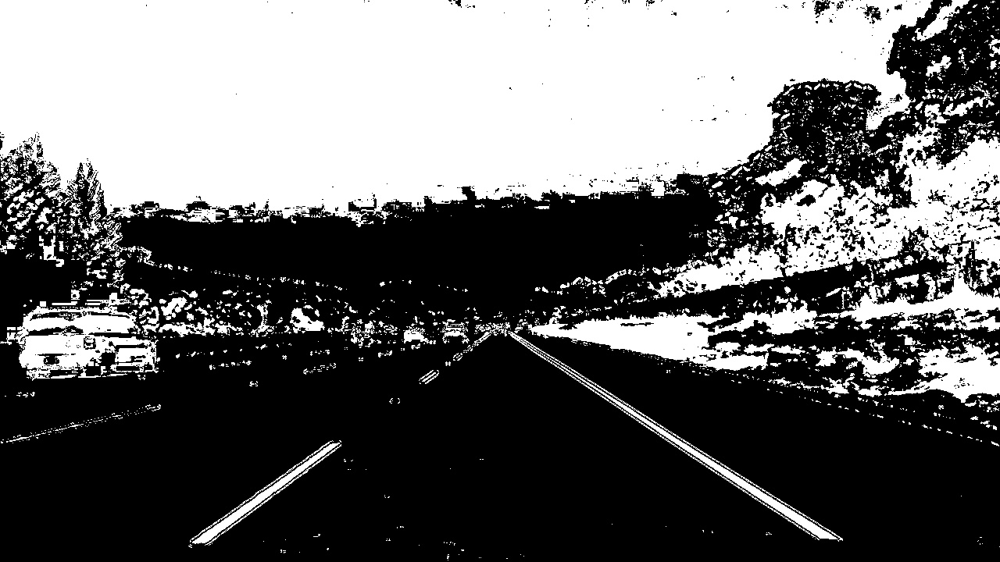
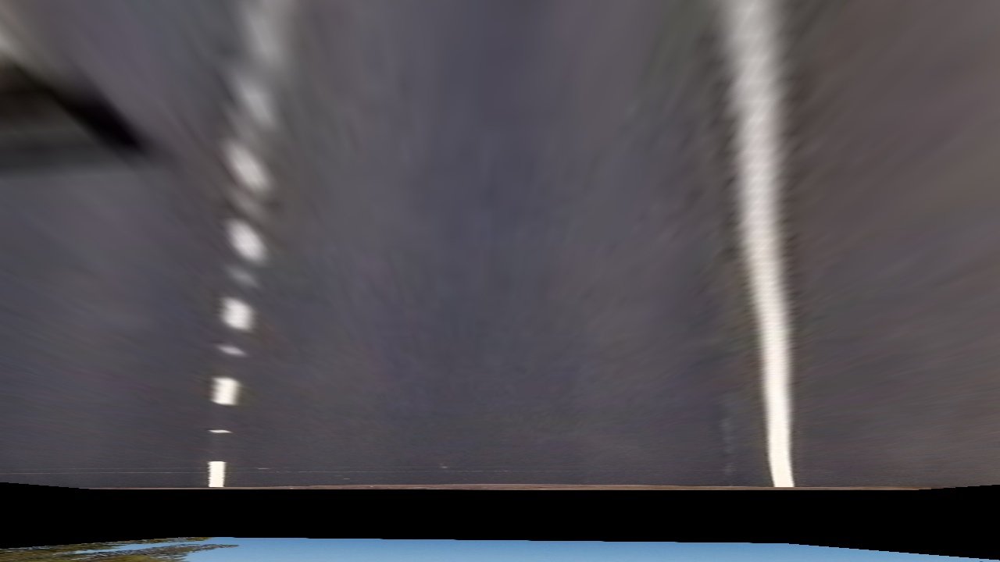
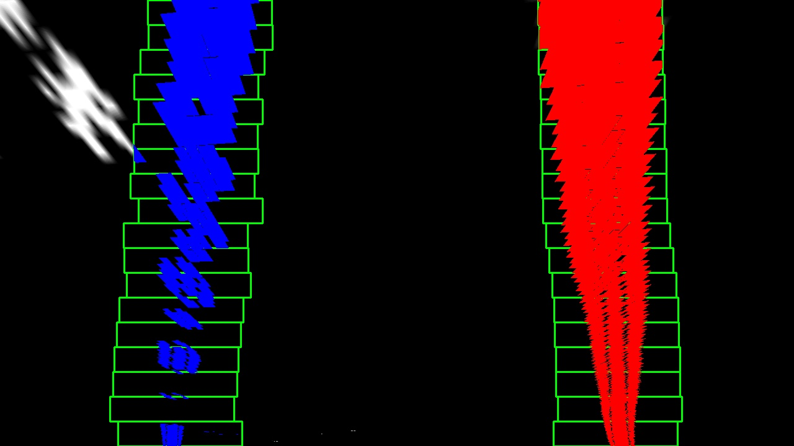

### Camera Calibration Project Writeup

#### 1. Briefly state how you computed the camera matrix and distortion coefficients. Provide an example of a distortion corrected calibration image.

The code for this step is contained in `Scripts/Callibration.py`. The calibrator is written as a class so one project can have different calibrators for each camera. In the file called `example.py`, an object of Calibrator is created. Then all files from `camera_cal/*.jpg` filePath will be pass to the object as an instance parameter when it is created. Then the function called `findObjPointsAndClib` will give the coefficients of camera calibration. Functions like `draw_img2img()` can use the function called `undistorting()` of Calibrator class to get the undistorted version of one picture based on the coefficients from `findObjPointsAndClib`.

Inside of the Calibration class, I start by preparing "object points", which will be the (x, y, z) coordinates of the chessboard corners in the world. Here I am assuming the chessboard is fixed on the (x, y) plane at z=0, such that the object points are the same for each calibration image.  Thus, `objp` is just a replicated array of coordinates, and `objpoints` will be appended with a copy of it every time I successfully detect all chessboard corners in a test image.  `imgpoints` will be appended with the (x, y) pixel position of each of the corners in the image plane with each successful chessboard detection.  

I then used the output `objpoints` and `imgpoints` to compute the camera calibration and distortion coefficients using the `cv2.calibrateCamera()` function.  I applied this distortion correction to the test image using the `cv2.undistort()` function and obtained this result: 


### Pipeline (single images)

#### 1. Provide an example of a distortion-corrected image.

To demonstrate this step, I will describe how I apply the distortion correction to one of the test images like this one (this is the same picture as the last one):


#### 2. Describe how (and identify where in your code) you used color transforms, gradients or other methods to create a thresholded binary image.  Provide an example of a binary image result.

I used a combination of color (S channel in HSV only) and gradient thresholds (X, Y, specified direction and gradient magnitude) to generate a binary image (thresholding steps at `abs_sobel_thresh()`,`mag_thresh()`,`dir_threshold()` and `get_S()` in the class `EdgeTransFormer` of file `EdgeDetection.py`).  Here's an example of my output for this step.  



#### 3. Describe how (and identify where in your code) you performed a perspective transform and provide an example of a transformed image.

The code for my perspective transform is located in the class of `Transformer` in the file `Transform.py`(Scripts/Transform.py). It includes a function called `warpImage()`, which appears in lines 71.  
This class will be given a default source point set and destination point set based on test images with the size of 1280*720. 

User can call the function `start_gather()` (implementation example is in the `example.py` in line 127 commented for now) to manually set the source point set by clicking on a pop-up window. Four points will be gathered based on the order of clicking (transfer function uses points from top left to bottom left counter-clock wise). The current default source points are gathered by this way. Because the image might be huge, so there is a resizeScale instance variable for controlling the pop-up window size.

The `resetDstPoints()` function can be called when a different output size is using. The scale factor parameter in this function is used for determining how far away the lines should be with each other after the transformation. If the scale factor is set as 0.25, then the left line should be at the place of 25% width and the right line should be at the place of 75% width starting from the left of an image.

The `warpImage()` function takes as inputs an image (`undistort`), using the pre-determined source and destination point sets from the parameters in the object.  I chose the hardcode the source and destination points in the following manner:

```python
    resizeScale = 0.5
    scaleFactor = 0.2

    left_upper_corner = (568, 470)
    right_upper_corner = (710, 470)
    left_bottom_corner = (210, 710)
    right_bottom_corner = (1074, 710)

    srcPoints = np.float32([left_upper_corner, right_upper_corner, right_bottom_corner, left_bottom_corner])*resizeScale
    srcPoints = srcPoints*(1/resizeScale)

    img_size = (1280, 720)
    left_upper_corner = (img_size[0]*scaleFactor, 0)     
    right_upper_corner = (img_size[0]*(1-scaleFactor), 0)     
    left_bottom_corner = (img_size[0]*scaleFactor, img_size[1]) 
    right_bottom_corner = (img_size[0]*(1-scaleFactor), img_size[1])
    dstPoints = np.float32([left_upper_corner, right_upper_corner, right_bottom_corner, left_bottom_corner])

```

This resulted in the following source and destination points:

| Source        | Destination   | 
|:-------------:|:-------------:| 
| 568, 470      | 256, 0        | 
| 210, 710      | 256, 720      |
| 1074, 710     | 1024, 720      |
| 710, 460      | 1024, 0        |

I verified that my perspective transform was working as expected by checking that the lines appear parallel in the warped image of the straight line testing image.



The binary image of edge detection after transformation is shown below,


#### 4. Describe how (and identify where in your code) you identified lane-line pixels and fit their positions with a polynomial?

Then I did some other stuff and fit my lane lines with a 2nd order polynomial in the file of `Polynomial.py`. The result is like this:



The `search_around_poly()` is used to search around previous result. But during processing the video, search around function did not run asymptotical faster than just using `find_lane_pixels()` and sliding box every frame.

#### 5. Describe how (and identify where in your code) you calculated the radius of curvature of the lane and the position of the vehicle with respect to center.

I did this in lines #228 through #231 in my code in `Polynomial.py` in the function of `measure_curvature_real()`. The code for implementation for a single picture is in line #154 in the file of `example.py`. The code for implementation for a video is in line #53 through #56 (the radius for video is the mean of radius of the left line and the right line which makes it outliers sensative).

#### 6. Provide an example image of your result plotted back down onto the road such that the lane area is identified clearly.

I implemented this step in lines #63 through #96 in my code in the function `drawlines()` in the file `example.py`.  Here is an example of my result on a test image:


---

### Pipeline (video)

#### 1. Provide a link to your final video output.  Your pipeline should perform reasonably well on the entire project video (wobbly lines are ok but no catastrophic failures that would cause the car to drive off the road!).

Here's a [link to my video result](test_videos_output/project_video.mp4)

Some quick Notes for outliers. I detect outliers and mark them as red so that we can clearly distinguish when the function just mis-recognizes or when it can detect outliers and are able to do some optimization in the future.

And there are also two other video outputs for challenging videos [link to my challenge video result](test_videos_output/challenge_video.mp4) and [link to my harder challenge video result](test_videos_output/harder_challenge_video.mp4) .

---

### Discussion

#### 1. Briefly discuss any problems / issues you faced in your implementation of this project.  Where will your pipeline likely fail?  What could you do to make it more robust?

I am using classical CV tricks to try to detect lane lines. As you can see, the result is fragile and extremely sensitive to bright and dark changes (which will also cause turbulence on the S space too). This problem is even obvious in the not challenging video result. Applying more tricks might provide better result under certain test cases but will also make the model more fragile (just like being overfitted). So pattern detection is needed for this problem. If I was going to pursue this project further, more process on the image to make the lines more easy to detect and using Neural Networks to detect the pattern seems to be a reasonable direction.


